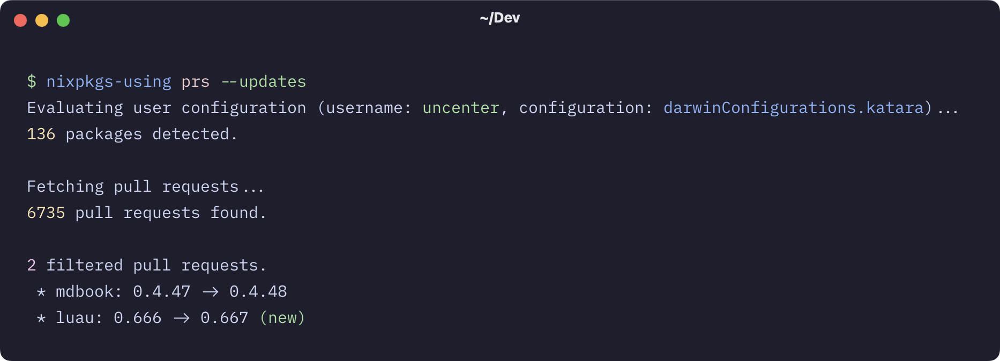

# nixpkgs-using

Find packages that you use that are currently being updated in Nixpkgs.



## Installation

### Nix

```
nix run github:uncenter/nixpkgs-using
```

### Cargo

```sh
cargo install --git https://github.com/uncenter/nixpkgs-using.git
```

## Usage

```
nixpkgs-using [OPTIONS] <COMMAND>
```

| Option            | Description                                                                                                                                                                                                               |
| ----------------- | ------------------------------------------------------------------------------------------------------------------------------------------------------------------------------------------------------------------------- |
| `--flake`         | Path to the flake to evaluate. Defaults to the `FLAKE` environment variable, if present.                                                                                                                                  |
| `--configuration` | Configuration to extract packages from (e.g., `darwinConfigurations.Katara`). Defaults to `*configurations.<hostname>`, where `*configurations*` is detected from your operating system and the presence of `/etc/NIXOS`. |
| `--username`      | Username to locate [Home Manager](https://github.com/nix-community/home-manager) packages from. Defaults to the username of the user running the process.                                                                 |
| `--json`          | Output the results as JSON.                                                                                                                                                                                               |

### `list`

List the detected packages from evaluating your flake.

### `prs`

Requires a GitHub API token to use, provided through the `--token` flag or from the `GITHUB_TOKEN`/`GH_TOKEN` environment variables. With roughly 6,000 open pull requests on [NixOS/nixpkgs](https://github.com/NixOS/nixpkgs), ~60 API requests are made per run to fetch 100 pull requests at a time.. GitHub's documentation on GraphQL ratelimiting isn't very clear so I can't say for certain how many runs it will take for the rate limit to be reached, but for good measure don't run it more then 5-ish times an hour.

#### `--repository`

The (GitHub) repository from which pull requests are fetched. Defaults to [`NixOS/nixpkgs`](https://github.com/NixOS/nixpkgs).

#### `--updates`

Shown pull requests that are detected to be package updates (filters for pull requests that include a `->` in the title, as is the preferred commit/pull request title style in [NixOS/nixpkgs](https://github.com/NixOS/nixpkgs)).

#### `--new`

Shown pull requests that have not already been shown (filters for pull requests created after the timestamp of the last `nixpkgs-using` invocation).

## License

[MIT](LICENSE)
